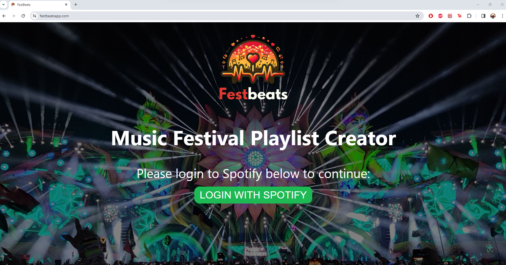
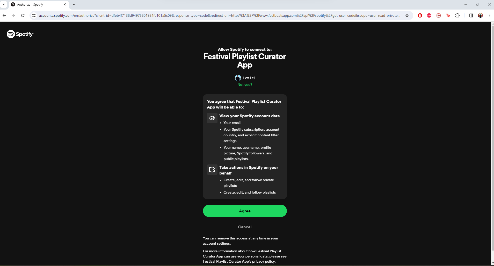
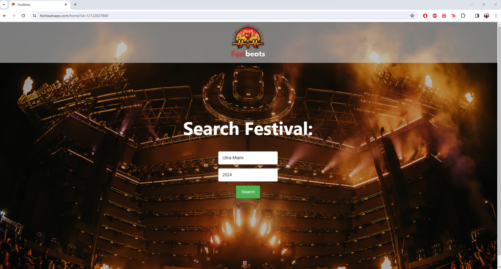
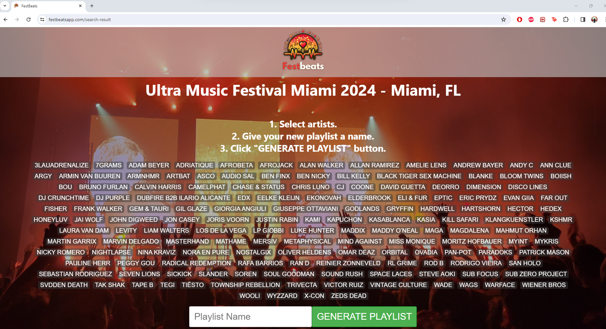
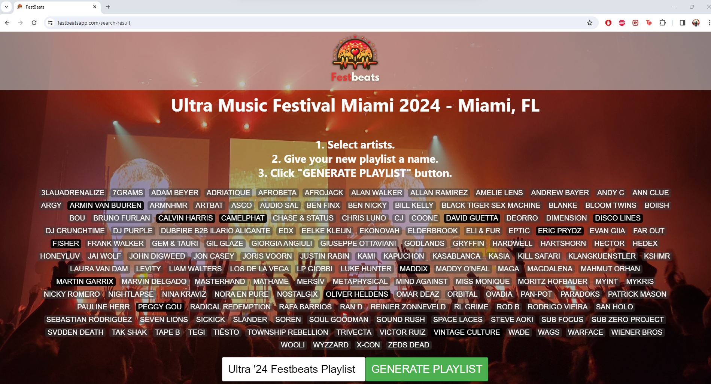
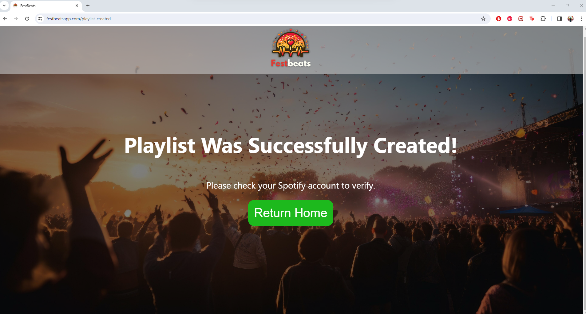
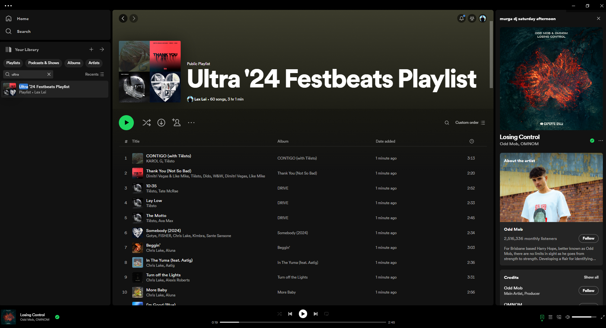

# *OCTOBER 2024 UPDATE*

The website I am using to scrape festival data has changed their search functionality, I am currently in the process of implementing Selenium to fix this issue. For now, users will not be able to search festival lineups. Hoping to get this resolved ASAP.

# Music Festival Web Application

This project is a full-stack web application that allows users to explore music festivals, view artist lineups, select artists of interest, and create custom playlists based on these selections. The application integrates with the Spotify API to fetch artist and song data and create playlists in the user's Spotify account.

## Features

- User authentication (login and registration)
- Search functionality for music festivals
- Display of festival lineups
- Selection of favorite artists
- Playlist creation with top songs from selected artists
- Integration with Spotify API
- Responsive web design

## Technologies Used

- Frontend: React, HTML, CSS, JavaScript
- Backend: Node.js, Spring Boot, Java
- Database: SQL
- Additional Libraries: React Router

## Getting Started

### Prerequisites

- Node.js
- npm (Node Package Manager)
- Java (for Spring Boot)
- React
- SQL database

### Installation

1. **Clone the repository**

   ```bash
   git clone https://github.com/lexzlei/Festival-Playlist-Curator-for-Spotify.git
   cd Festival-Playlist-Curator-for-Spotify

2. **Install Node.js dependencies**

   ```bash
   cd frontend
   npm install
   
3. **Set up the backend**

   Navigate to the backend directory and follow the instructions to set up the Spring Boot application and the database.

4. **Environment Variables**

   Set up the required environment variables (port 3000 for frontend, port 8080 for backend, database url) for both frontend and backend.

### Running the Application

1. **Start the backend server**

   Navigate to the backend directory and run:
   ```bash
   ./mvnw spring-boot:run

2. **Start the frontend**

   Open a new terminal, navigate to the frontend directory, and run:
   ```bash
   npm start

### Usage

After starting the application, you can:

- Read the homepage.



- Register a new user account or log in with existing spotify credentials.



- Search for music festivals.



- View artist lineups for selected festivals.



- Create and manage playlists based on selected artists.





## Contact

lexleims@gmail.com

Project Link: [https://github.com/lexzlei/Festival-Playlist-Curator-for-Spotify.git](https://github.com/lexzlei/Festival-Playlist-Curator-for-Spotify.git)
